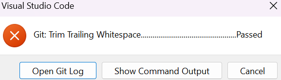

Guide to install and use Pre-commit hooks
=========================================

## Introduction
This guide is for current and potential developers who contribute to this project to set up code quality checks before each commit.

## Packages Overview
We use pre-commit and other packages to automatically check and clean your code before commits. Make sure you’ve installed the hooks after setting up the environment. Below is a brief summary of all the packages you will need to install and implement for this project. by _Auto-fixable_ it means ```black``` will automatically fix the warnings for you after running checks.

1. ```pre-commit-hooks```

    See documentation [here](<https://pre-commit.com/>)

   1. ```trailing-whitespace``` – Removes trailing spaces and tabs. ✅ Auto-fixable
   2. ```end-of-file-fixer``` – Ensures files end with a single newline. ✅ Auto-fixable
   3. ```check-added-large-files``` – Blocks large files (>500KB) from being committed. ❌ Not fixable

2. ```flake8```

    See documentation [here](<https://flake8.pycqa.org/en/latest/#>)

    Python linter: checks for syntax errors, unused code, style violations, and potential bugs. ❌ Does not auto-fix issues — fix them manually based on the output

3. ```black```

   See documentation [here](<https://black.readthedocs.io/en/stable/index.html#>)

   Opinionated Python formatter: fixes indentation, quote style, line breaks, etc. ✅ Auto-formats your code with no configuration needed

4. ```isort```

   See documentation [here](<https://pycqa.github.io/isort/index.html>)

   Automatically sorts imports alphabetically, and automatically separated into sections and by type(standard, third-party, local) ✅ Auto-fixable

5. ```mypy```

   See documentation [here](<https://mypy.readthedocs.io/en/stable/index.html>)
   A static type checker to check if your code is following your type hints. ❌ Not fixable


## Installation

1. clone this repo to your local device

    ```git clone https://github.com/BredaUniversityADSAI/2024-25d-fai2-adsai-group-cv9.git```

2. Navigate to root direcory

    ```cd 2024-25d-fai2-adsai-group-cv9```

3. Activate the required environment via [this guide](<https://github.com/BredaUniversityADSAI/2024-25d-fai2-adsai-group-cv9/blob/main/Other%20Evidence/Setups%20and%20Guides/Environment%20%26%20Poetry%20Setup%20Instructions%20(Windows%20%2B%20Conda).pdf>)

4. Install Poetry

    ```pip install poetry```

5. Install dependencies

    ```poetry install```

    This installs all dependencies (including ```pre-commit```, ```black```, etc.).

6. Activate pre-commit hooks defined in your ```.pre-commit-config.yaml``` file

    ```poetry run pre-commit install```


## Usage

### every time you commit your codes, formatting and linting checks will run automatically.

### Run individual tools manually (optional)

You can also run each tool directly, for example:

**Flake8**
```poetry run flake8 path/to/code.py```

**black**
```poetry run black path/to/code.py```


## After Committing: Understanding Pre-commit Warnings

After each commit, you may see a warning like this:



Click **"Show Command Output"** to see which files didn’t pass the automatic checks.

Only after fixing the issues can you successfully commit your code.

### Common Pre-commit Warnings

#### 1. Auto-fixable issues

```
Trim Trailing Whitespace (or other package names).................................................Failed
- hook id: (package name)
- exit code: 1
- files were modified by this hook
```

**What it means**: The issue was automatically fixed (e.g., by `black` or `pre-commit-hooks`).
You just need to stage the updated files and try committing again:

#### 2. Manual fixes required

```
flake8...................................................................Failed
- hook id: flake8
- exit code: 1

your_file.py:3:1: F401 'numpy' imported but unused
```

**What it means**: The issue cannot be auto-fixed — for example, unused imports, bad syntax, etc.
You’ll need to fix these manually in your code.


#### 3. Commit again after fixing every issue

```
git add .
git commit -m "fix: resolved flake8 errors"
git push origin your-branch-name
```

## Troubleshooting

If pre-commit hooks aren't triggering:

1. Make sure you ran `poetry run pre-commit install`
2. Make sure `.pre-commit-config.yaml` and `pyproject.toml` exists in the root of the project
3. If you’ve installed pre-commit globally by accident, uninstall it and rely on Poetry:

   `pip uninstall pre-commit`

Or optionaly contact one of our teammates.
